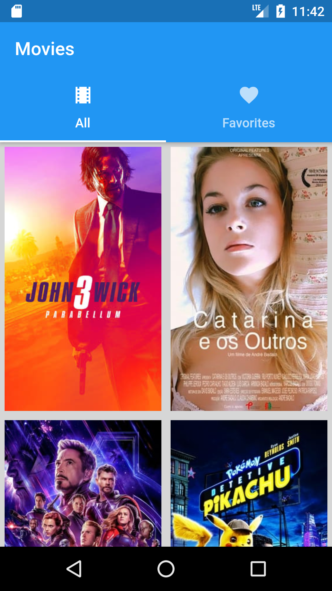
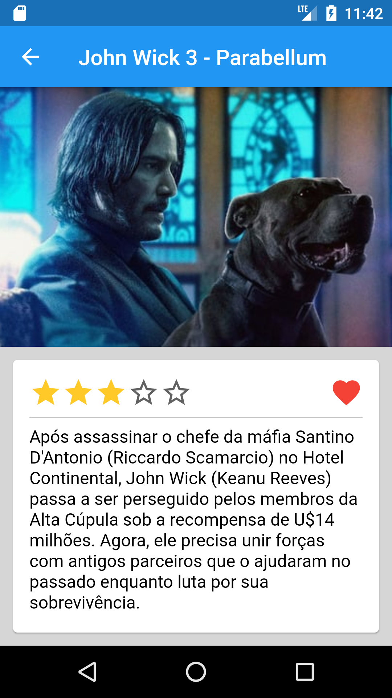
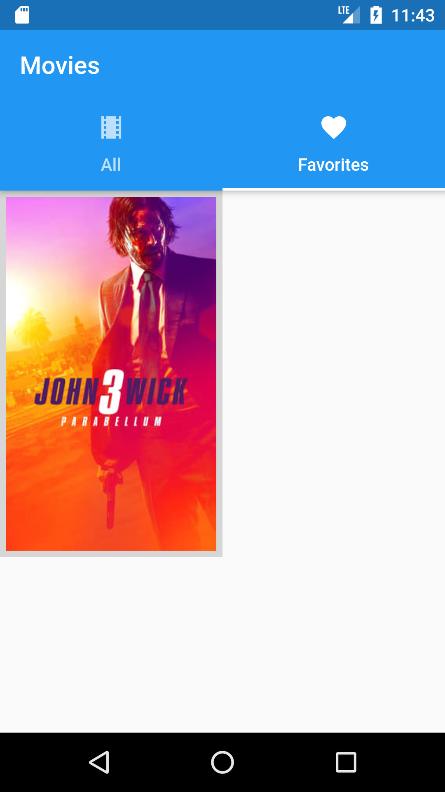
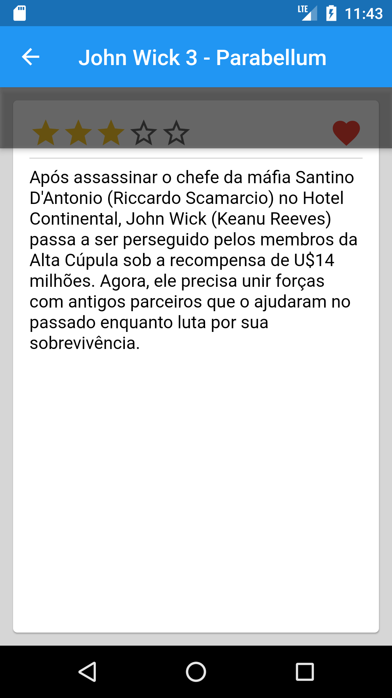

# Flutter

## Android Avançado

Trabalho final apresentado para o professor Ricardo Lecheta na disciplina de android avançado no curso de pos graduação de dispositivos moveis e computação na nuvem.

### Screenshot 

{:height="50%" width="50%"}
{:height="50%" width="50%"}
{:height="50%" width="50%"}
{:height="50%" width="50%"}
{:height="50%" width="50%"}
